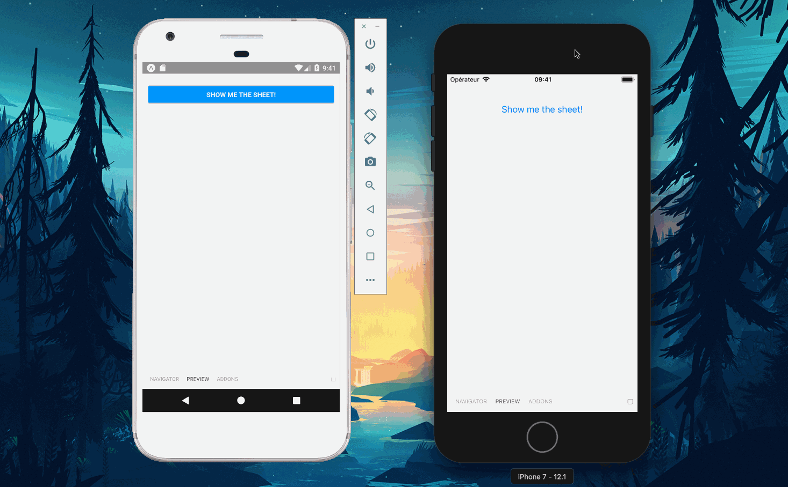

[](https://travis-ci.org/mfrachet/action-sheet-rn)
[](https://opensource.org/licenses/MIT)

Probably the most declarative API for ActionSheets in React Native



# Usage

## Installation

```javascript
$ yarn add action-sheet-rn
```

## In your code

```jsx
import { ActionSheet, SheetItem, SheetDivider } from "action-sheet-rn";

// Icons can be defined as:
// const ShareIcon = <Image source={require("./share.png")} />
// const CreateIcon = <Image source={require("./create.png")} />
// const RemoveIcon = <Image source={require("./remove.png")} />
// const LocateIcon = <Image source={require("./locate.png")} />
// const ShareIcon = <Image source={require("./remove.png")} />

const App = ({ isVisible }) =>
  isVisible && (
    <ActionSheet title="What do you want to do?">
      <SheetItem Icon={ShareIcon} onPress={handleShare}>
        Share
      </SheetItem>

      <SheetItem Icon={CreateIcon} onPress={handleCreate}>
        Create
      </SheetItem>

      <SheetItem Icon={RemoveIcon} type="remove" onPress={handleRemove}>
        Remove
      </SheetItem>

      <SheetDivider />

      <SheetItem Icon={LocateIcon} onPress={handleLocate}>
        Locate
      </SheetItem>

      <SheetItem type="cancel" onPress={handleCancel}>
        Cancel
      </SheetItem>
    </ActionSheet>
  );
```

## How it works?

### iOS

It displays a native `ActionSheet` using [ActionSheetIOS](https://facebook.github.io/react-native/docs/actionsheetios).

On a `SheetItem`, you can specify a `type` of value `cancel | remove` that will allow to customize its style (positionning the cancel button to the bottom and adding the red style of the remove one).

_The `Icon` prop has no effect on the iOS Action Sheet. It's only relevant for Android_

### Android

It displays a custom and JavaScript implementation of a [Modal Bottom Sheet from the Material Design Spec](https://material.io/design/components/sheets-bottom.html#modal-bottom-sheet). For now, it's not implemented 100%, but I really hope it will (missing the gesture handling + the number of visible items etc..)

On Android, the `SheetItem` with the `cancel` type won't be visible. Instead, the lib will handle the click on the opaque zone as a cancellation (only when the `type="cancel"` is provided to keep consistency between iOS and Android).

You can also pass an `Icon` props to the `SheetItem` so that it adds a little Icon on the left, always following the spec concerning size / margins.

_The `remove` type as no specific effects on Android._
